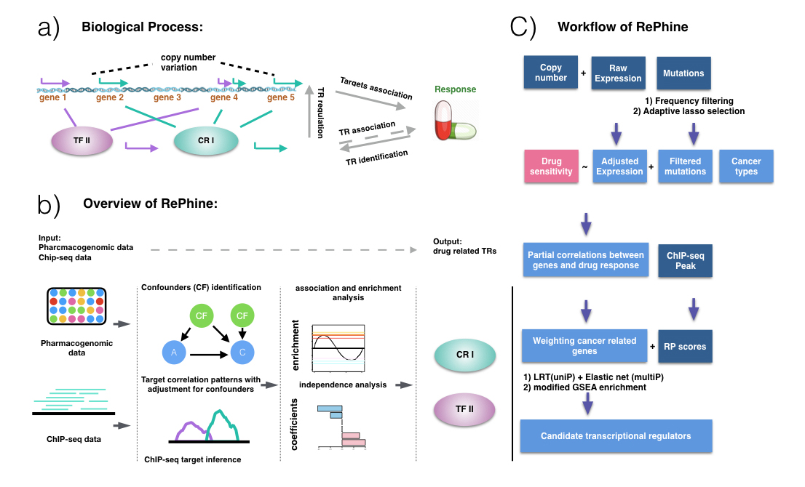

# Rephine

Now RePhine version 1.1.0 is released.

1.1.0) RePhine now supports visualization of enrichment patterns between TRs and drugs of interest ([see guide for details](https://github.com/coexps/Rephine/blob/master/RePhine%20User%20Guide.pdf)).

RePhine is a method for identification of drug response related transcriptional regulators by modeling correlation patterns of targets. RePhine takes in pharmacogenomics data containing gene expression, copy number, mutation status, cancer type information and pharmacological profiles for estimation of associations between genes expression and drug response. It also takes in ChIP-seq data for target inference.

The RePhine method consists of the following steps:
1)	Estimate the adjusted expression for each gene by removing the effects of copy number through linear regression.
2)	Identify mutated genes related to drug response based on the CCLE mutation data and pharmacology profiles through an adaptive lasso model and likelihood ratio test.
3)	Compute the partial correlation between a specific gene and a drug by controlling the confounding factors.
4)	Repeat step 3 for next gene.
5)	Down-weight non-cancer related genes.
6)	Use likelihood ratio test to evaluate significance (uniP) of the TRs whose targets have concordant positive or negative partial correlations with drug response and apply the elastic net analysis combined with likelihood ratio test (multiP) to select the independent TRs.
7)	Use a modified GSEA algorithm to further filter the top candidate lists derived from step 6.

## Prerequisites
* Python
* R and packages "glmnet", "MASS", "lmtest", "ppcor", "psych", "ROCR"

## Documents
Rephine_1.1.0.tar.gz is the R scource code package to process Pharmacogenomic data and ChIP-seq data by using RePhine. For details and guides, please see RePhine User Guide.
Rephine_1.1.0.zip is the binary package for Windows to process Pharmacogenomic data and ChIP-seq data by using RePhine. For details and guides, please see RePhine User Guide.

RP_calculation_modified.py is the modified python script which calculates the RP scores by consider both distance and peak strength. It takes in peak bed files of ChIP-seq data.

simulation_code.R is the simulation R code. it simulate TR and targets expression data, noise data and RP scores.

drug_code_R.R is the RePhine R code.

RePhine User Guide.pdf is the user guide telling how to use RePhine to process data and indenty TRs.

## Installation
You might use R function install.packages() to install the Rephine package. For more details, you might see the user guide. 

## Resources
Regulatory potential scores across more than 1000 ChIP-seq data from Encode that are used in RePhine analysis are available on [google drive](https://drive.google.com/open?id=1NwzZ5rdhYG-QlG956oFLmJyjyBpLty6A). These data will be update with new TFs soon. 

CRISPR screening data of PLX4720 results processed by MaGeck are available on [google drive](https://drive.google.com/file/d/1PVRZ8IrGZojku3GZYOXGag2gG1eXWXN5/view?usp=sharing) as well GitHub.

## Application
RePhine was applied to the Liver cancer cell dataset and identified novel candidates related to drug response.

[A Pharmacogenomic Landscape in Human Liver Cancers.Cancer Cell. 2019 Aug 12;36(2):179-193.e11. doi: 10.1016/j.ccell.2019.07.001. Epub 2019 Aug 1.](https://www.ncbi.nlm.nih.gov/pubmed/31378681)

## Contact
_wangxujun87@sjtu.edu.cn_

